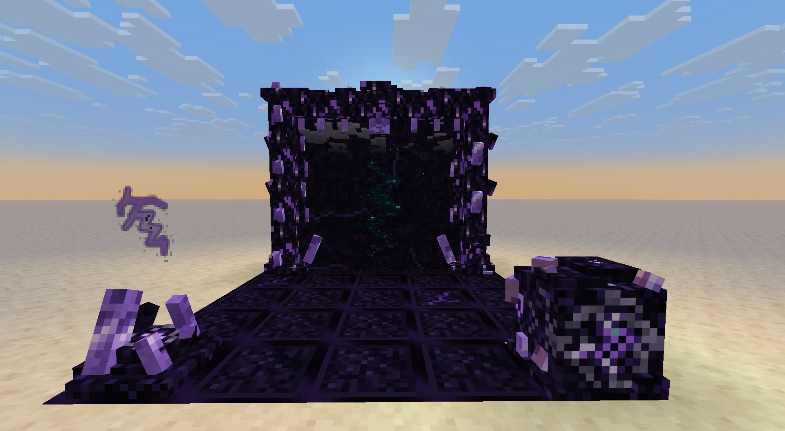
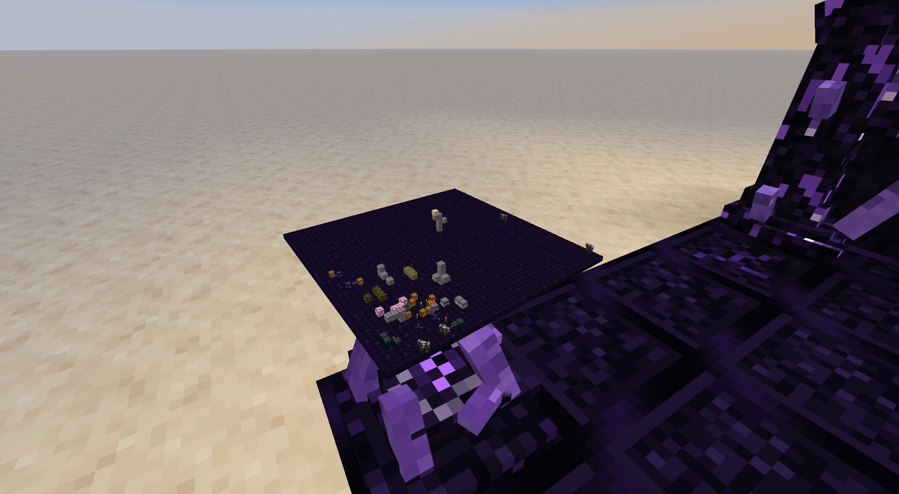
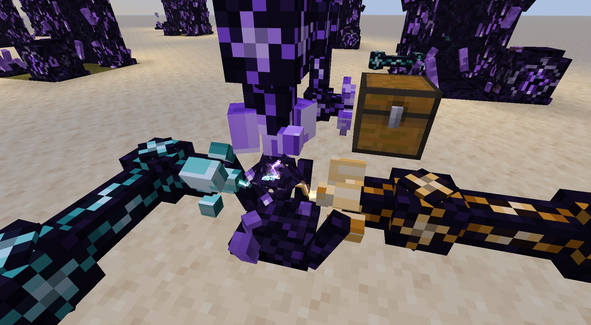

# AlchyRift

A rift mod for NeoForge (Minecraft 26.1.2), built on [AlchyX](https://github.com/JustAlex14/AlchyX). Raise a crude gate of obsidian and amethyst, tear reality open in its frame, and walk into a room of your own inside the void. Then keep it supplied from the world you left.



- **Rift Gates**: a small multiblock that opens onto one of your rooms, or onto another of your gates. The rift tears wider as you come near, and the floor takes on the ground of wherever it leads
- **Rooms in the void**: yours, named, as many as you want, from 1x1 to 3x3 chunks. Share them with friends, set their rules (spawns, explosions), grow them with Void Seeds
- **Looking in**: stare into the rift above the stabilizer and a living miniature of the room comes out of it, mobs and players included
- **Conduits**: item, fluid and energy lines with sieves (filters) and surge crystals (speed), all set with the Rift Tuner
- **Rift Relays and Ports**: wireless links between conduit lines, across dimensions for the greater ones, and straight through a gate into its room
- **Greater Rift Gate**: a larger gate whose destination can be changed at any time
- **Exile's Notebook**: an in-game journal (Patchouli) whose paper corrupts as its writer goes deeper

## Screenshots

<table>
<tr><td width="50%"><br><b>Looking in</b>: the whole room, alive, hanging over the stabilizer</td><td width="50%"><br><b>Conduits</b>: a fluid line and an energy line meeting at a Rift Relay</td></tr>
</table>

## Requirements

- NeoForge 26.1.2
- [AlchyX](https://github.com/JustAlex14/AlchyX) 0.2.0 or newer
- Optional: Patchouli (the notebook), JEI (recipes), Jade

## Configuration

`config/alchyrift-common.toml` sets the largest room size and the price of each growth, the floor block a gate takes for each dimension (custom dimensions included), and how far surge crystals push a conduit. `config/alchyrift-client.toml` sets how far and how detailed the miniatures are drawn.

## Building

AlchyX must sit next to this folder (`../AlchyX`): Gradle builds it together with this project.

```
./gradlew build
```

The jar ends up in `build/libs`.

## License

MIT, see [LICENSE](LICENSE).

A few textures are recolored from Minecraft and Patchouli textures; those stay under their original owners' terms.
